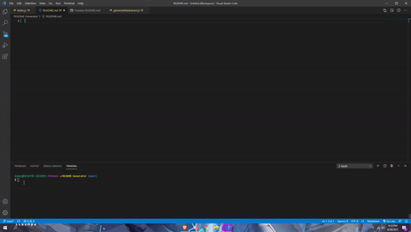

# **README.md Generator**
## Description 
This is a node.js application that allows the user to create a custom tailored README.md file with all inputs that they need for their project.
## Table of contents
- [Description](#Description)
- [Installation](#Installation)
- [Usage](#Usage)
- [Licence](#Licence)
- [Contributors](#Contributors)
- [Test](#Test)
- [Repository Link](#Repository)
- [GitHub Info](#GitHub) 
## Installation
        In the terminal, the user will run "node index.js". The user will then answer all the questions that the application prompts by hitting the "Enter" key. Once all questions are answered, a brand new README.md file will be created, and the user will be informed in the console.
## Test

## Repository
- [Project Repo](https://github.com/jacobduden/README-Generator)
## GitHub

- [GitHub Profile](https://github.com/jacobduden)